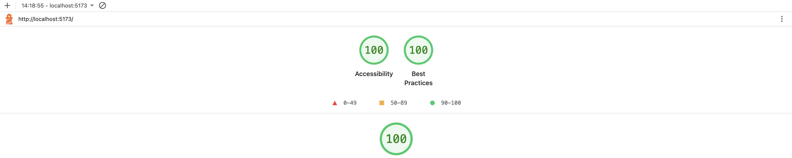
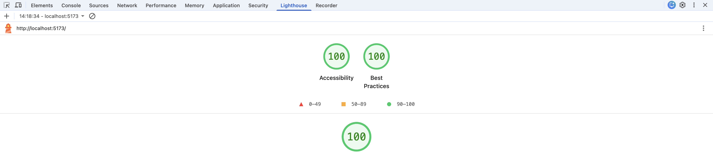
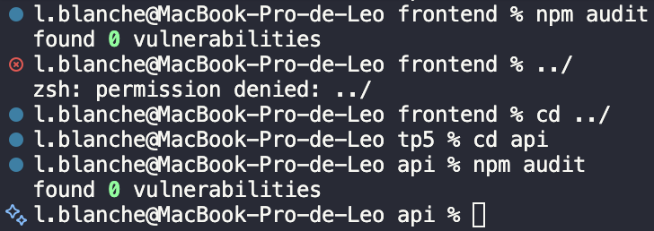

# Gestionnaire de tâches

## Lancer le projet

Prérequis : Docker et Node.js.

1. Créer le fichier `.env` à partir de l'exemple, puis renseigner les valeurs :

   ```bash
   cp .env.example .env
   ```

   Dans Docker, l'API joint la base par le nom du service : `DB_HOST=db`, `DB_PORT=5432`. Les valeurs `DB_USER`, `DB_PASSWORD` et `DB_NAME` doivent être identiques à `POSTGRES_USER`, `POSTGRES_PASSWORD` et `POSTGRES_DB`. Pour le front en local : `CORS_ORIGIN=http://localhost:5173`.

2. Démarrer la base de données et l'API (port 3000) :

   ```bash
   docker compose up -d --build
   ```

   Au premier démarrage, `db-init/01-init.sql` crée la table `tasks` et les tâches de départ.

3. Lancer le frontend (port 5173) :

   ```bash
   cd frontend
   npm install
   npm run dev
   ```

   L'application est disponible sur <http://localhost:5173>.

Commandes utiles :

```bash
docker compose logs api   # journaux de l'API
docker compose down       # arrêter les conteneurs
docker compose down -v    # arrêter et supprimer les données (init.sql sera rejoué)
```

## Fiche du traitement : bénévole assigné à une tâche

- **Responsable** : l'association (contact : <contact@association.example>).
- **Finalité** : savoir quel bénévole s'occupe de chaque tâche. Aucun autre usage (ni statistiques, ni prospection, ni partage avec des tiers).
- **Données collectées** : le prénom du bénévole uniquement. Ni nom de famille, ni e-mail, ni téléphone. L'API refuse tout autre champ et n'écrit jamais le contenu des requêtes dans ses journaux.
- **Durée de conservation** : le prénom est conservé tant que la tâche existe et supprimé en même temps qu'elle.
- **Personnes qui y ont accès** : les membres de l'association qui utilisent l'application, et la personne chargée de la maintenance technique (accès à la base de données).
- **Droits des bénévoles** : accès, rectification, effacement et opposition. Pour les exercer :
  - dans l'application : le bouton « Retirer le bénévole » efface le prénom sans supprimer la tâche, le bouton « Modifier » permet de le corriger ;
  - par e-mail : <contact@association.example>.
- **Traceurs** : aucun (pas d'outil de statistiques, de pixel publicitaire ni de script tiers), donc pas de bandeau cookies.

## Audits

### Lighthouse

Audit Lighthouse sur <http://localhost:5173> : 100 en accessibilité et 100 en bonnes pratiques.





### Dépendances

`npm audit` dans `frontend` et dans `api` : aucune vulnérabilité trouvée.



## Questions

**Pourquoi aucune variable `VITE_` ne contient de secret ?**
Au moment du build, Vite recopie les variables `VITE_` directement dans le JavaScript envoyé au navigateur. N'importe qui peut donc les lire, avec les outils de développement ou en ouvrant le fichier `.js`. Les secrets, comme le mot de passe de la base, restent côté serveur, dans le `.env` de l'API et de Docker, et ne sont jamais envoyés au navigateur.

**Pourquoi la validation du frontend ne suffit pas ?**
Elle tourne dans le navigateur, que l'utilisateur contrôle entièrement. On peut la contourner en modifiant le code, ou en appelant l'API directement avec `curl` ou Postman. Elle sert seulement au confort : elle signale une erreur tout de suite. La vraie protection, c'est le schéma Joi de l'API, qui vérifie chaque requête quelle que soit son origine : prénom de 50 caractères maximum, champs inconnus refusés.

**Pourquoi l'application n'a pas besoin de bandeau cookies ?**
Le consentement n'est obligatoire que pour les traceurs qui ne sont pas indispensables au service : statistiques, publicité, scripts tiers. L'application n'en a aucun. Il n'y a donc rien à soumettre au consentement.
